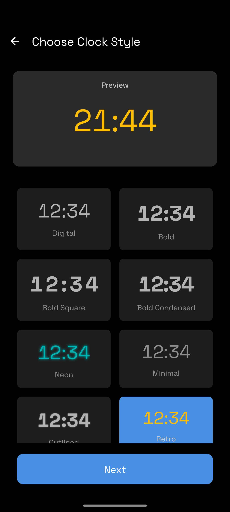
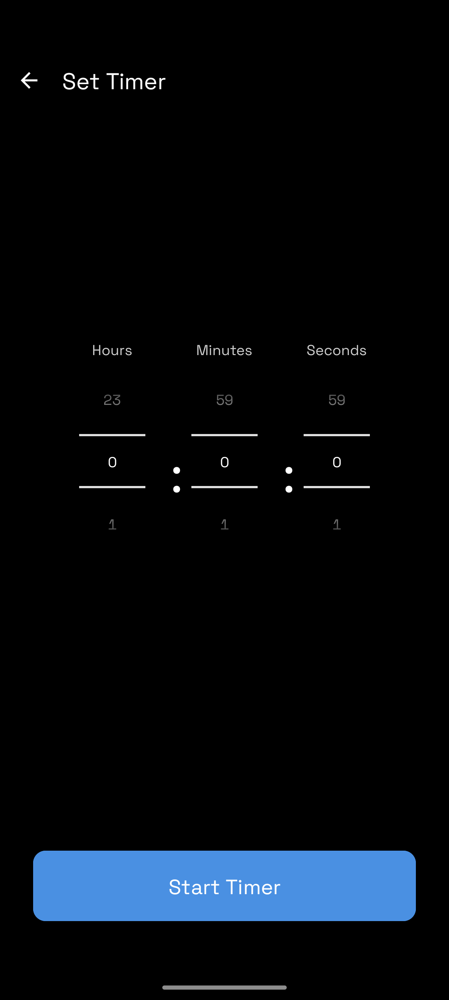

# StandBy Mode - Android App

A feature-rich Android standby mode application with customizable clock styles and countdown timer functionality.

## Features

### 🔌 Auto-Launching Standby Screen
- Automatically launches when device is plugged into a charger
- Full-screen immersive display
- Shows current time, date, and battery status
- Closes automatically when charger is disconnected
- Customizable clock styles

### 🎨 Clock Style Selection
Choose from 6 different clock styles:
- **Digital** - Clean, light sans-serif
- **Bold** - Strong, heavy typeface
- **Neon** - Cyan glow effect
- **Minimal** - Ultra-thin, subtle
- **Outlined** - Bold with shadow outline
- **Retro** - Monospace amber display

Your selected style persists across app restarts and applies to the standby screen.

### ⏱️ Countdown Timer
- Set custom countdown with hours, minutes, and seconds
- Full-screen landscape mode during countdown
- Screen stays on throughout timer
- Large, easy-to-read display
- Stop button for manual cancellation
- Auto-closes with completion message

## Screenshots

| Settings | Clock Styles | Timer Setup |
|:---:|:---:|:---:|
|  |  |  |

## Technical Specifications

- **Minimum SDK**: Android 8.0 (API 26)
- **Target SDK**: Android 14 (API 34)
- **Language**: Kotlin
- **Architecture**: ViewBinding, SharedPreferences
- **Layout System**: ConstraintLayout

## Project Structure

```
app/src/main/
├── java/com/standby/mode/
│   ├── MainActivity.kt                 # Home/settings screen (launcher)
│   ├── ClockStyleActivity.kt           # Clock style selector
│   ├── TimerSetupActivity.kt           # Timer configuration
│   ├── TimerLandscapeActivity.kt       # Active countdown display
│   ├── StandByModeActivity.kt          # Charging screen
│   ├── PowerReceiver.kt                # Charging event listener
│   ├── ClockStyleManager.kt            # Style persistence
│   └── TimerManager.kt                 # Countdown logic
├── res/
│   ├── layout/                         # All XML layouts
│   ├── values/                         # Strings, colors, themes
│   └── ...
└── AndroidManifest.xml
```

## Installation & Build

See [BUILD_INSTRUCTIONS.md](BUILD_INSTRUCTIONS.md) for detailed build steps.

**Quick Build**:
```powershell
$env:JAVA_HOME = "C:\Program Files\Java\jdk-21"
./gradlew clean assembleDebug
```

Install APK:
```powershell
adb install app/build/outputs/apk/debug/app-debug.apk
```

## Usage

1. **Launch App**: Open "StandBy Mode" from app drawer
2. **Select Clock Style**: Tap "Clock Styles" and choose your preferred style
3. **Set Timer**: Tap "Countdown Timer", set time, and tap "Start"
4. **Charging Mode**: Plug device into charger to activate full-screen standby

## Permissions

- `WAKE_LOCK` - Keep screen on during standby and timer
- `RECEIVE_BOOT_COMPLETED` - Enable receiver after device restart
- `FOREGROUND_SERVICE` - Support for background operations

## Compatibility

- Android 12, 13, 14 (tested)
- Android 8.0+ (minimum supported)
- Portrait and landscape orientations
- Physical devices recommended (emulator may not support charging simulation)

## Author

Built with Kotlin and Android Studio for reliable, offline standby functionality.

## License

This project is provided as-is for personal use.
